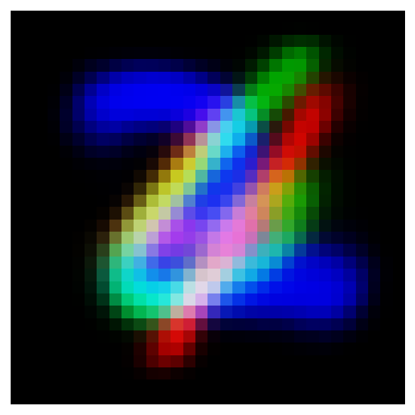

## Requirements

- Python = 3.10
- pytorch = 2.1.0
- cuda-version = 12.1

## Quick Example With The Weights We Provided

You can just run the `visrf.py` . The link of the weights we provided are here.

If you want to generate 8*8 samples，you can use the code below:

```python
trainer.visualize_generation(num_samples=64, save_path="random_samples/generated_samples.png", save_separately=False)
```

Then you will get a picture just like this:


If you want to generate hundreds of samples, you can use the code below: 

```python
trainer.visualize_generation_separately(num_samples=150000, save_path="results/final_generated_samples.png", save_separately=True)
```

Then you will get hundreds of samples under a sperate folder, just like this:

```
generate_samples/
├── samples_00000.png
├── samples_05000.png
├── ...
├── samples_145000.png
└── samples_150000.png
```

<p align="center">
  
  
  
  
  
</p>


## Train VAE

The data we used for training is stacked MNIST, and you can run the `dataset.py` to generate the data for training

After you get the training data, you can run the `trainvae.py` to train the VAE, and the structure of the VAE we designed is in the `model.py`. The best weight of the VAE will be stored under the checkpoint folder. The weight of the VAE will be used later.

## Value The Latent Space

You can use the VAE weight to value the latent space. The method involves randomly sampling from the latent space and decoding the samples into images. You can run `visual.py` to visualize the results.

Then you will get a picture just like this:


## Train Spherical Interpolation Flow Model

The spherical interpolation formula we use is:

$$
\text{slerp}(t) = \frac{\sin((1 - t)\omega)}{\sin(\omega)} \mathbf{x}_0 + \frac{\sin(t \omega)}{\sin(\omega)} \mathbf{x}_1
$$

$$
\omega = \arccos(\mathbf{x}_0^\top \mathbf{x}_1)
$$

The unit velocity at ${x}_0$ is:

$$
\frac{\mathbf{x}_1 - (\mathbf{x}_0^\top \mathbf{x}_1)\mathbf{x}_0}{\sin(\omega)}
$$

$$
\omega = \arccos(\mathbf{x}_0^\top \mathbf{x}_1)
$$

The unit velocity at ${x}_t$ is:

$$
\frac{\mathbf{x}_1 - (\mathbf{x}_t^\top \mathbf{x}_1)\mathbf{x}_t}{\sin(\omega)}
$$

$$
\omega = \arccos(\mathbf{x}_t^\top \mathbf{x}_1)
$$

Then, the velocity field is used to approximate the true velocity.

Then we perform step-wise differentiation in the latent space. Since this process may lead to slight deviations from the unit hypersphere, we normalize the final output to ensure the final point lies on the sphere.

You can run the `main.py` to train the Spherical Interpolation Flow Model.

## Train Classifier

We use the Resnet18 as our classifier. The structure of the classifier is in the `model.py` 

## Evaluate The Results


At last ,you can run the `classfierrf.py` to test the percentage of pattern coverage.
